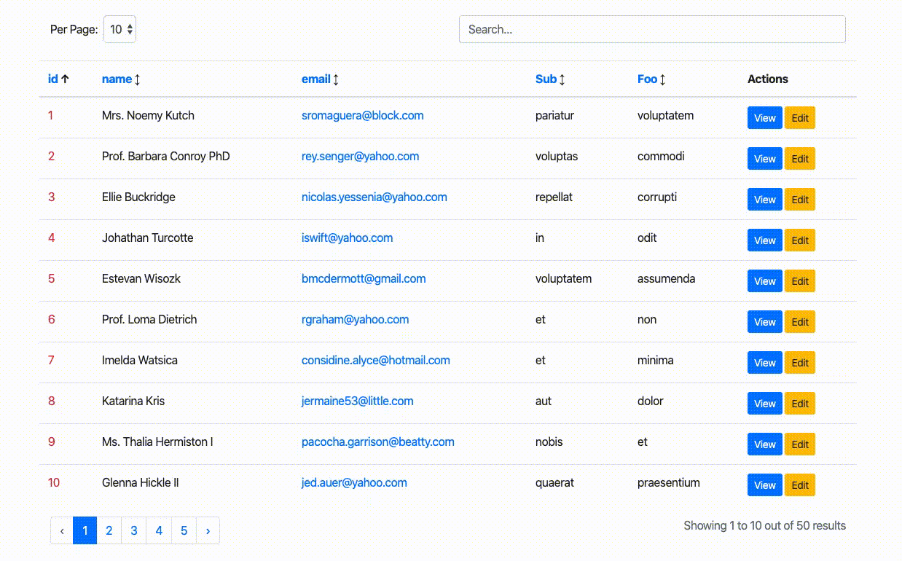

# Livewire Smart Table
An advanced, dynamic datatable component with pagination, sorting, and searching including json data.



## Installation

You can install the package via composer:

```bash
composer require tkaratug/livewire-smart-table
```

## Requirements
This package uses livewire/livewire (https://laravel-livewire.com/) under the hood.

It also uses Bootstrap (https://getbootstrap.com/) for base styling.

Please make sure you include both of these dependencies before using this component.

## Usage
In order to use this component, you must create a new Livewire component that extends from `LivewireSmartTable`

You can use `make:livewire` to create a new component. For example.

```
php artisan make:livewire UserList
```

In the `UserList` class, instead of extending from the base Livewire Component class, extend from `LivewireSmartTable` class.
Also, remove the render method. You'll have a class similar to this snippet. 

In this class, you must define columns that you want to show in a table.

```php
class UserList extends LivewireSmartTable
{
    $columns = [
        'id' => [
            'type' => 'string', // column type
            'name' => 'Id', // column header
            'class' => 'text-danger', // column class
        ],
        'name' => [
            'type' => 'string',
            'name' => 'Name',
        ],
        'email' => [
            'type' => 'string',
            'name' => 'E-Mail',
        ],
    ];
}
```

Keys of columns array must be the same as column names in database table or key of a json object.

To render the component in a view, just use the Livewire tag or include syntax.

```blade
<livewire:user-list
   :query="$query" // required
   table-class="class for the table" // optional
/>
```

`$query` must be instance of an **Eloquent Collection**.

For example, create a `UserController` class, select users to show in a table and pass them to a view file.

````php
class UserController extends Controller
{
    public function index()
    {
        $users = App\User::where('is_active', '=', true)->get();

        return view('users', ['users' => $users]);
    }
}
````

Then in `users.blade.php` use Livewire tag and give users to `query` attribute.
```
<livewire:user-list :query="$users" />
```

## Column Properties
### ```string```
It is used for showing data as string in HTML table.

### ```link```
It is used for showing data as link in HTML table. 

In addition to type, you must define a `url` to redirect when clicked.
```php
$columns = [
    'profile' => [
        'type' => 'link',
        'url' => 'http://example.com/users/{id}/profile',
        'target' => '_blank'
    ],
];
```

It is also possible to give parameters to the URL. All you need to do is give the column name containing the data you want to pass to the url in curly braces.

Let's say you have a database table contains blog posts and each post has a slug. To show post titles in html table as a link, you need to define column as follows:
```php
'title' => [
    'type' => 'link',
    'url' => 'http://example.com/posts/{slug}',
];
```
The component is smart enough to find the `slug` field of current record and give it to the url.

### ```json```
It is used for showing data from json columns. If you have a json column in your database table, you can show values from it in html table.

Let's say you have a json column named `contact` in your database table and contains address details in it.

`{"address":{"country":"Turkey","city":"Istanbul","state":"Besiktas"}}`

To show just the city in html table, you need to define column as follows:
```php
'city' => [
    'type' => 'json',
    'name' => 'City', // Text for column header
    'from' => 'contact', // field that contains json data in a db table
    'value' => 'address.city' // nested json value
];
```
It will find the json data from `contact` column, and take city value inside address key then show it on the table.

### ```actions```
It is used for showing action links for each row in html table. 

You need to give `element` and `url` keys for the html element of the link and url to redirect.

```php
'actions' => [
    'type' => 'actions',
    'name' => 'Actions', // Text for column header
    'actions' => [
        [
            'element' => '<button>View</button>',
            'url' => 'http://example.com/users/{id}/profile'
        ],
        [
            'element' => '<button>Edit</button>',
            'url' => 'http://example.com/users/{id}/edit'
        ],
    ]
];
```

## Testing

```bash
composer test
```

## Security

If you discover any security related issues, please email tkaratug@hotmail.com.tr instead of using the issue tracker.

## Credits

- [Turan Karatuğ](https://github.com/tkaratug)

## License

The MIT License (MIT). Please see [License File](LICENSE.md) for more information.
